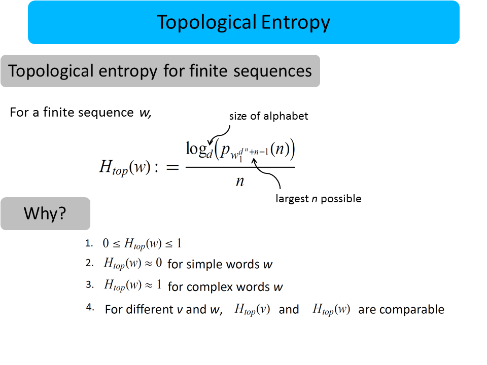

### Summary
I define a new notion of "randomness" (called topological pressure) suitable for use on sequences of symbols (words) of finite length. I show that this can be used to distinguish between biologically interesting sequences in the human genome.

### Abstract
Motivation: Topological entropy has been one of the most difficult to implement of all the entropy-theoretic notions. This is primarily due to finite sample effects and high-dimensionality problems. In particular, topological entropy has been implemented in previous literature to conclude that entropy of exons is higher than of introns, thus implying that exons are more ‘random’ than introns.
Results: We define a new approximation to topological entropy free from the aforementioned difficulties. We compute its expected value and apply this definition to the intron and exon regions of the human genome to observe that as expected, the entropy of introns are significantly higher than that of exons. We also find that introns are less random than expected: their entropy is lower than the computed expected value. We also observe the perplexing phenomena that introns on chromosome Y have atypically low and bimodal entropy, possibly corresponding to random sequences (high entropy) and sequences that posses hidden structure or function (low entropy).

