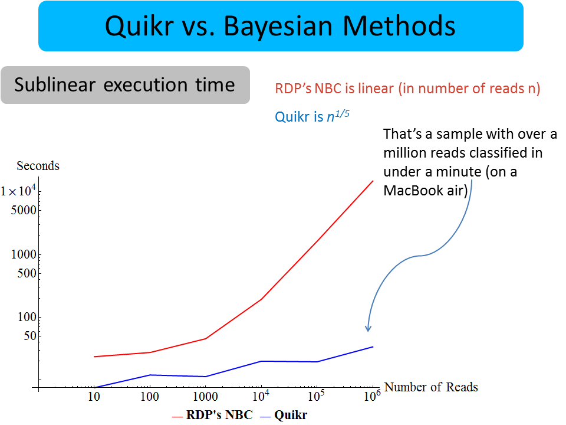
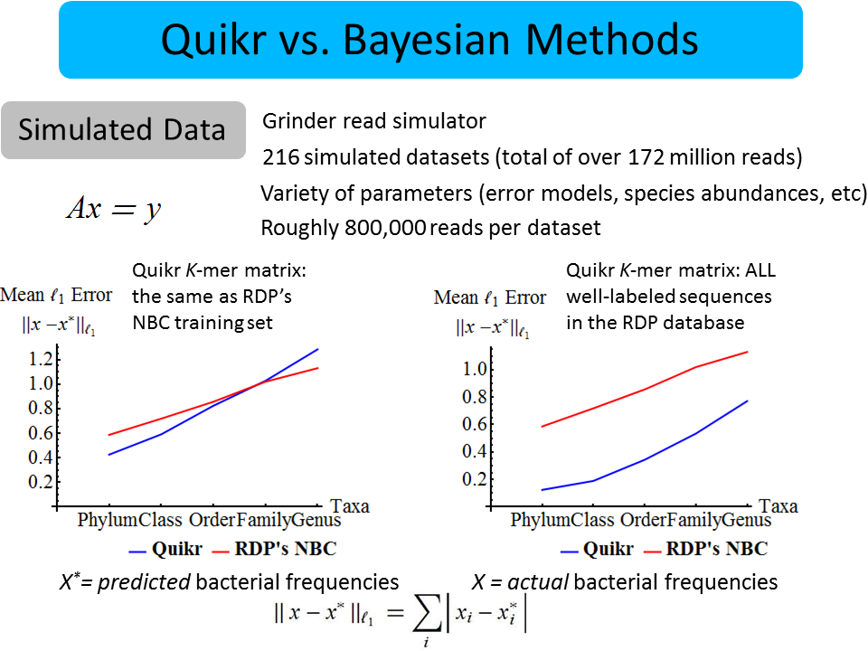

### Summary
We introduce an extremely fast, light-weight, "big data" algorithm to quickly answer the question of "which bacteria are present?" in a given sample of DNA. The method is based on the theory of compressed sensing and aims to find the simplest explanation for the data in terms of known information.

### Abstract
Motivation: Many metagenomic studies compare hundreds to thousands of environmental and health-related samples by extracting and sequencing their 16S rRNA amplicons and measuring their similarity using beta-diversity metrics. However, one of the first steps—to classify the operational taxonomic units within the sample—can be a computationally time-consuming task because most methods rely on computing the taxonomic assignment of each individual read out of tens to hundreds of thousands of reads.

Results: We introduce Quikr: a QUadratic, K-mer–based, Iterative, Reconstruction method, which computes a vector of taxonomic assignments and their proportions in the sample using an optimization technique motivated from the mathematical theory of compressive sensing. On both simulated and actual biological data, we demonstrate that Quikr typically has less error and is typically orders of magnitude faster than the most commonly used taxonomic assignment technique (the Ribosomal Database Project’s Naïve Bayesian Classifier). Furthermore, the technique is shown to be unaffected by the presence of chimeras, thereby allowing for the circumvention of the time-intensive step of chimera filtering.

