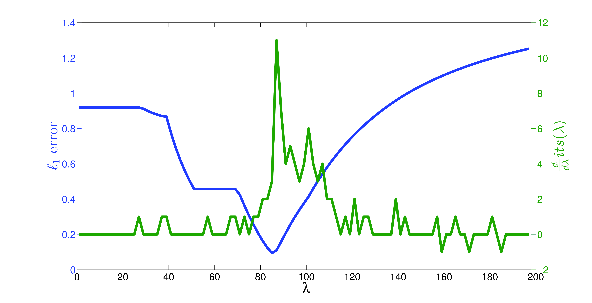

### Summary
Extending the results of Quikr to whole genome shotgun metagenomic samples, we develop a method to automatically select a parameter that balances sparsity (how succinct the result is) with accuracy.

### Abstract
With the decrease in cost and increase in output of whole-genome shotgun technologies, many metagenomic studies are utilizing this approach in lieu of the more traditional 16S rRNA amplicon technique. Due to the large number of relatively short reads output from whole-genome shotgun technologies, there is a need for fast and accurate short-read OTU classifiers. While there are relatively fast and accurate algorithms available, such as MetaPhlAn, MetaPhyler, PhyloPythiaS, and PhymmBL, these algorithms still classify samples in a read-by-read fashion and so execution times can range from hours to days on large datasets.

We introduce WGSQuikr, a reconstruction method which can compute a vector of taxonomic assignments and their proportions in the sample with remarkable speed and accuracy. We demonstrate on simulated data that WGSQuikr is typically more accurate and up to an order of magnitude faster than the aforementioned classification algorithms. We also verify the utility of WGSQuikr on real biological data in the form of a mock community.

WGSQuikr is a Whole-Genome Shotgun QUadratic, Iterative, K-mer based Reconstruction method which extends the previously introduced 16S rRNA-based algorithm Quikr.

