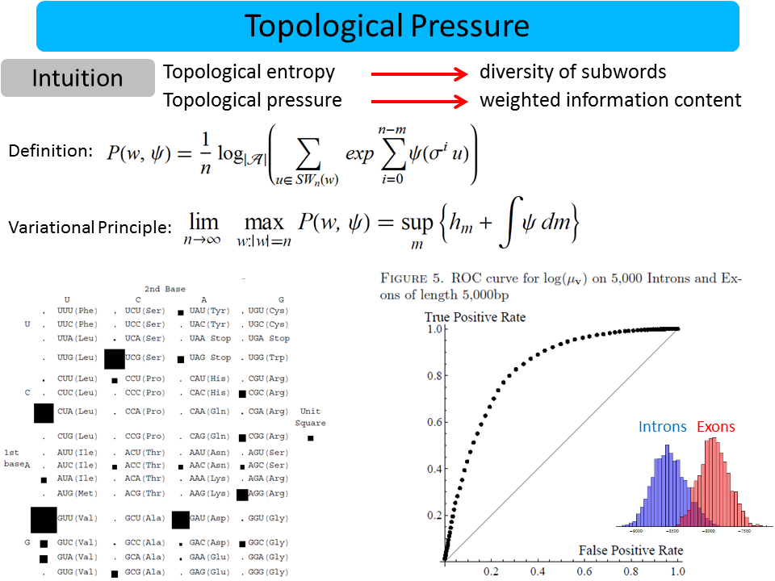

### Summary
We demonstrate that a concept of "weighted information content" (known as topological pressure, from the ergodic theory literature) can be used to facilitate the analysis of genomic data (in particular, find areas of a genome that have many genes in them). This is a conceptual extension to topological entropy approach presented earlier.

### Abstract
We give a new approach to coding sequence (CDS) density estimation in genomic analysis based on the topological pressure, which we develop from a well known concept in ergodic theory. Topological pressure measures the ‘weighted information content’ of a finite word, and incorporates 64 parameters which can be interpreted as a choice of weight for each nucleotide triplet. We train the parameters so that the topological pressure fits the observed coding sequence density on the human genome, and use this to give ab initio predictions of CDS density over windows of size around 66,000 bp on the genomes of Mus Musculus, Rhesus Macaque and Drososphilia Melanogaster. While the differences between these genomes are too great to expect that training on the human genome could predict, for example, the exact locations of genes, we demonstrate that our method gives reasonable estimates for the ‘coarse scale’ problem of predicting CDS density. Inspired again by ergodic theory, the weightings of the nucleotide triplets obtained from our training procedure are used to define a probability distribution on finite sequences, which can be used to distinguish between intron and exon sequences from the human genome of lengths between 750 and 5,000 bp. At the end of the paper, we explain the theoretical underpinning for our approach, which is the theory of Thermodynamic Formalism from the dynamical systems literature. 

