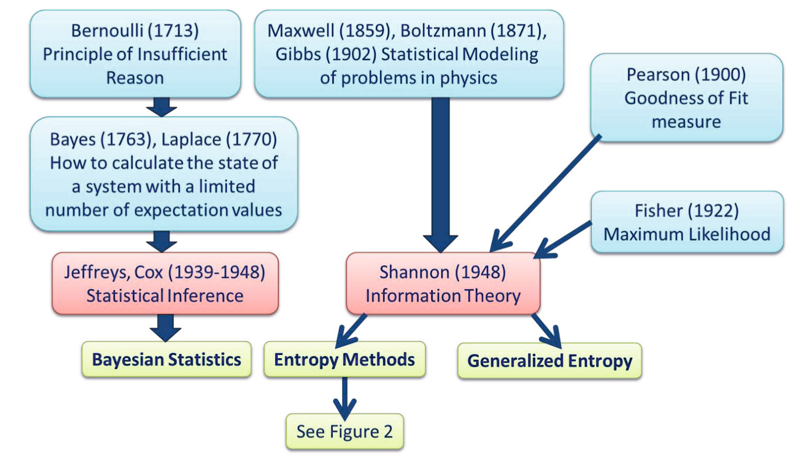

### Summary
We review a variety of entropy/randomness-based techniques that are useful in a variety of data mining applications.

### Abstract
In the real world, we are confronted not only with complex and high-dimensional data sets, but usually with noisy, incomplete and uncertain data, where the application of traditional methods of knowledge discovery and data mining always entail the danger of modeling artifacts. Originally, information entropy was introduced by Shannon (1949), as a measure of uncertainty in the data. But up to the present, there have emerged many different types of entropy methods with a large number of different purposes and possible application areas. In this paper, we briefly discuss the applicability of entropy methods for the use in knowledge discovery and data mining, with particular emphasis on biomedical data. We present a very short overview of the state-of-the-art, with focus on four methods: Approximate Entropy (ApEn), Sample Entropy (SampEn), Fuzzy Entropy (FuzzyEn), and Topological Entropy (FiniteTopEn). Finally, we discuss some open problems and future research challenges.

