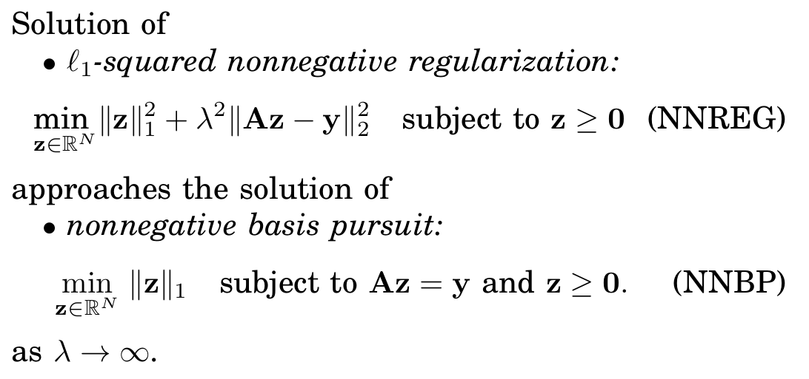

### Summary
We prove that nonnegative least squares (typically prone to over-fitting) can be slightly modified to return sparse results.

### Abstract
This letter demonstrates that sparse recovery can be achieved by an L1-minimization ersatz easily implemented using a conventional nonnegative least squares algorithm. A connection with orthogonal matching pursuit is also highlighted. The preliminary results call for more investigations on the potential of the method and on its relations to classical sparse recovery algorithms.

