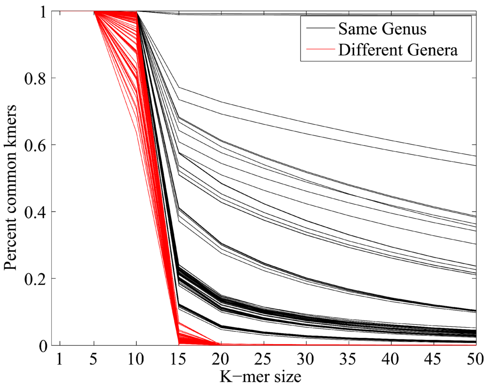

### Summary
We present a computational technique that answers the question "Which organisms are present in a given sample of of DNA from a microbial community, and at what relative amount" while simultaneously predicting the relatedness of novel (never-before seen organisms) in relation to known organisms. This relies on a mathematical technique referred to as sparsity-promoting optimization and relies on a technique similar to the Jaccard index.

### Abstract
Metagenomic profiling is challenging in part because of the highly uneven sampling of the tree of life by genome sequencing projects and the limitations imposed by performing phylogenetic inference at fixed taxonomic ranks. We present the algorithm MetaPalette which uses long k-mer sizes (k=30, 50) to fit a k-mer "palette" of a given sample to the k-mer palette of reference organisms. By modeling the k-mer palettes of unknown organisms, the method also gives an indication of the presence, abundance, and evolutionary relatedness of novel organisms present in the sample. The method returns a traditional, fixed-rank taxonomic profile which is shown on independently simulated data to be one of the most accurate to date. Tree figures are also returned that quantify the relatedness of novel organisms to reference sequences and the accuracy of such figures is demonstrated on simulated spike-ins and a metagenomic soil sample. 

