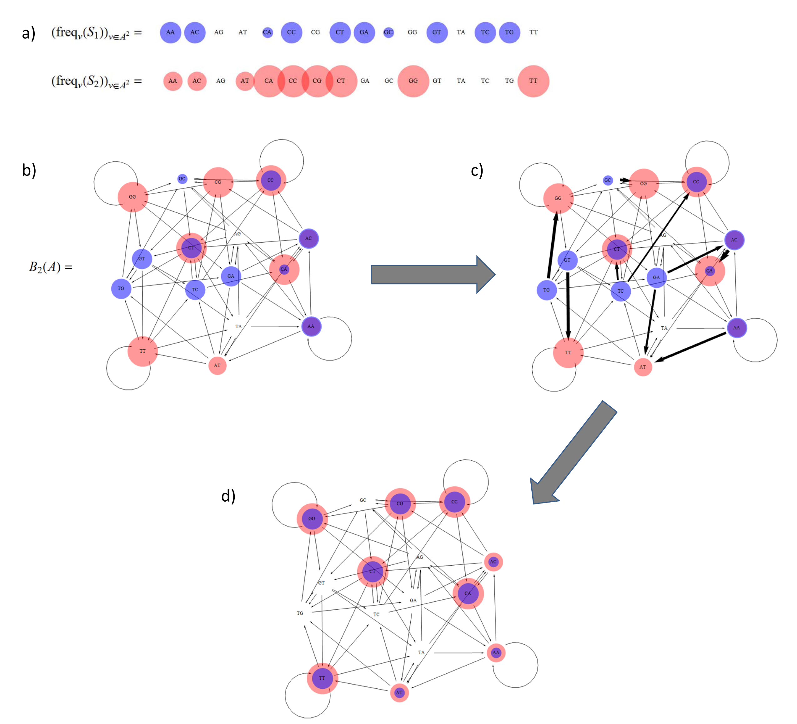

### Summary
We present the idea of using the "earth mover's distance" (aka the first Wasserstein metric) to measure the distance between samples of DNA. This reduces to finding the most efficient way to transform one kind of graph (known as de Bruijn graphs) into another.

### Abstract: 
Microbial communities inhabiting the human body exhibit significant variability across different individuals and tissues, and are suggested to play an important role in health and disease. High-throughput sequencing offers unprecedented possibilities to profile microbial community composition, but limitations of existing taxonomic classification methods (including incompleteness of existing microbial reference databases) limits the ability to accurately compare microbial communities across different samples. In this paper, we present a method able to overcome these limitations by circumventing the classification step and directly using the sequencing data to compare microbial communities. The proposed method provides a powerful reference-free way to assess differences in microbial abundances across samples. This method, called EMDeBruijn, condenses the sequencing data into a de Bruijn graph. The Earth Mover's Distance (EMD) is then used to measure similarities and differences of the microbial communities associated with the individual graphs. We apply this method to RNA-Seq data sets from a coronary artery calcification (CAC) study and shown that EMDeBruijn is able to differentiate between case and control CAC samples while utilizing all the candidate microbial reads. We compare these results to current reference-based methods, which are shown to have a limited capacity to discriminate between case and control samples. We conclude that this reference-free approach is a viable choice in comparative metatranscriptomic studies.

