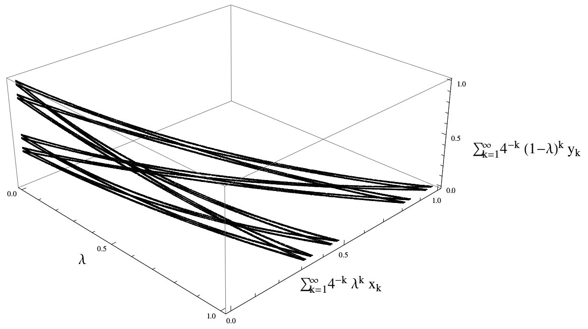

### Summary
After introducing the notion of a random substitution Markov chain, we relate it to other notions of a "random substitution" and give a complete description of the Martin boundary for a few interesting examples.

### Abstract
Substitution Markov chains have been introduced \cite {KoslickiThesis2012} as a new model to describe molecular evolution. In this note, we study the associated Martin boundaries from a probabilistic and topological viewpoint. An example is given that, although having a boundary homeomorphic to the well-known coin tossing process, has a metric description that differs significantly.

