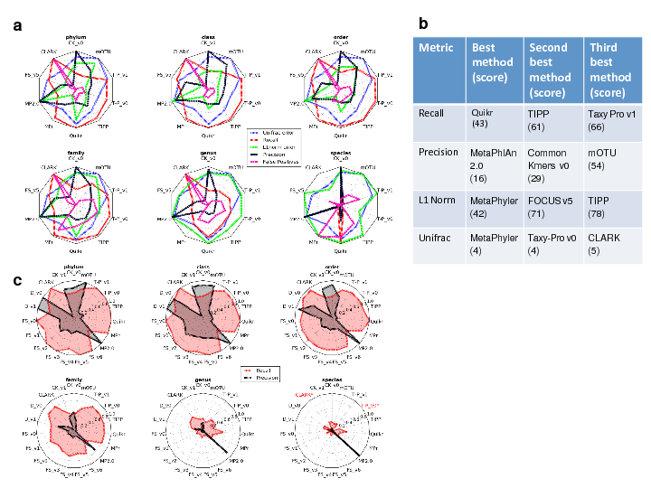

### Summary
In a very reproducible fashion, we assess a wide variety of computational techniques in metagenomics, including assembly (putting together pieces of genomes, called contigs, from short reads), binning (figuring out where the contigs came from), and taxonomic profiling (determining which organisms are present in a sample and at what relative amount).

### Abstract
In metagenome analysis, computational methods for assembly, taxonomic profiling and binning are key components facilitating downstream biological data interpretation. However, a lack of consensus about benchmarking datasets and evaluation metrics complicates proper performance assessment. The Critical Assessment of Metagenome Interpretation (CAMI) challenge has engaged the global developer community to benchmark their programs on datasets of unprecedented complexity and realism. Benchmark metagenomes were generated from newly sequenced ~700 microorganisms and ~600 novel viruses and plasmids, including genomes with varying degrees of relatedness to each other and to publicly available ones and representing common experimental setups. Across all datasets, assembly and genome binning programs performed well for species represented by individual genomes, while performance was substantially affected by the presence of related strains. Taxonomic profiling and binning programs were proficient at high taxonomic ranks, with a notable performance decrease below the family level. Parameter settings substantially impacted performances, underscoring the importance of program reproducibility. While highlighting current challenges in computational metagenomics, the CAMI results provide a roadmap for software selection to answer specific research questions.

