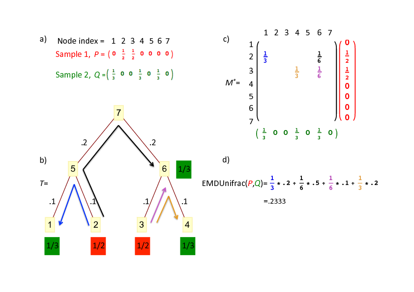

### Summary
Rapidly answers “why are these data sets different” by leveraging hierarchical/relatedness information. In short, we develop an algorithm to quickly compute the Unifrac distance by leveraging the earth mover's distance, prove its correctness, and derive time and space complexity characterizations.

### Abstract
Both the weighted and unweighted Unifrac distances have been very successfully employed to assess if two communities differ, but do not give any information about how two communities differ. We take advantage of recent observations that the Unifrac metric is equivalent to the so-called earth mover's distance (also known as the Kantorovich-Rubinstein metric) to develop an algorithm that not only computes the Unifrac distance in linear time and space, but also simultaneously finds which operational taxonomic units are responsible for the observed differences between samples. This allows the algorithm, called EMDUnifrac, to determine why given samples are different, not just if they are different, and with no added computational burden. EMDUnifrac can be utilized on any distribution on a tree, and so is particularly suitable to analyzing both operational taxonomic units derived from amplicon sequencing, as well as community profiles resulting from classifying whole genome shotgun metagenomes.

