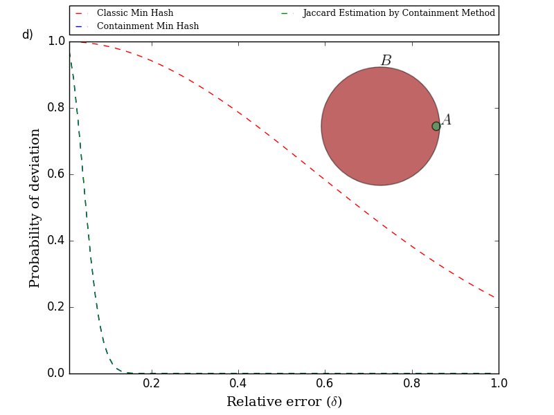

### Summary
This work improves upon the so called "min hash" technique (a "probabilistic data analysis" method) to develop a very fast and efficient way to estimate the similarity of two sets of objects (in terms of how much they overlap). The approach we present is orders of magnitude faster (and uses orders of magnitude less space) when two data sets under consideration are of very different size. The kinds of sets we consider are sets of sub-strings (called k-mers) of DNA sequences from communities of microorganisms.

### Abstract
Min hash is a probabilistic method for estimating the similarity of two sets in terms of their Jaccard index, defined as the ration of the size of their intersection to their union. We demonstrate that this method performs best when the sets under consideration are of similar size and the performance degrades considerably when the sets are of very different size. We introduce a new and efficient approach, called the containment min hash approach, that is more suitable for estimating the Jaccard index of sets of very different size. We accomplish this by leveraging another probabilistic method (in particular, Bloom filters) for fast membership queries. We derive bounds on the probability of estimate errors for the containment min hash approach and show it significantly improves upon the classical min hash approach. We also show significant improvements in terms of time and space complexity. As an application, we use this method to detect the presence/absence of organisms in a metagenomic data set, showing that it can detect the presence of very small, low abundance microorganisms.

