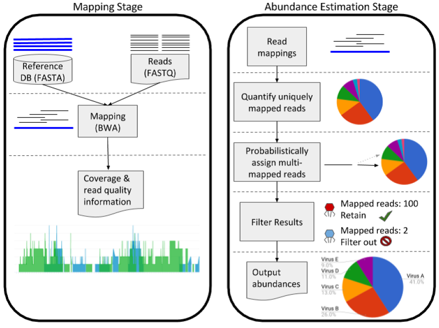
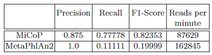

### Summary
We show that read mapping, along with a probabilistic assignment of multi-mapped reads, outperforms other computational approaches to identify the presence and relative amount of viral and fungal organisms in a metagenomic sample of microorganismal DNA.

### Abstract
Background: High throughput sequencing has spurred the development of metagenomics, which involves the direct analysis of microbial communities in various environments such as soil, ocean water, and the human body. Many existing methods based on marker genes or k-mers have limited sensitivity or are too computationally demanding for many users. Additionally, most work in metagenomics has focused on bacteria and archaea, neglecting to study other key microbes such as viruses and eukaryotes.
Results: Here we present a method, MiCoP (Microbiome Community Proling), that uses fast mapping of reads to build a comprehensive reference database of full genomes from viruses and eukaryotes to achieve maximum read usage and enable the analysis of the virome and eukaryome in each sample. We demonstrate that mapping of metagenomic reads is feasible for the smaller viral and eukaryotic reference databases. We show that our method is accurate on simulated and mock community data and identies many more viral and fungal species than previously-reported results on real data from the Human Microbiome Project.
Conclusions: MiCoP is a mapping-based method that proves more eective than existing methods at abundance proling of viruses and eukaryotes in metagenomic samples. MiCoP can be used to detect the full diversity of these communities. 

