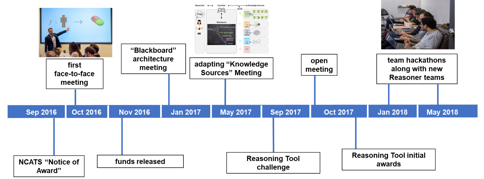
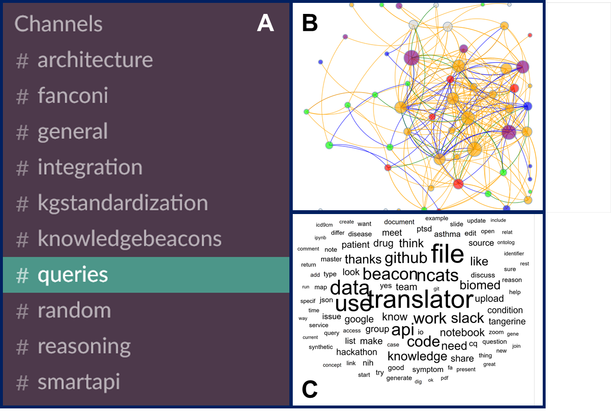

### Summary
A description of the NIH NCATS culture that emerged during the Translator project.

### Abstract
As part of the Biomedical Data Translator program, the National Center for Advancing Translational Sciences (NCATS) has assembled 11 teams comprising nearly 200 team members drawn from 29 institutions. Roughly one year into a two-year feasibility phase, we describe the program’s conception, the rapid coalescence of teams and team members, novel mechanisms of interaction and communication, and the emergent collaborative culture and community that we believe are driving the early success of the program.

