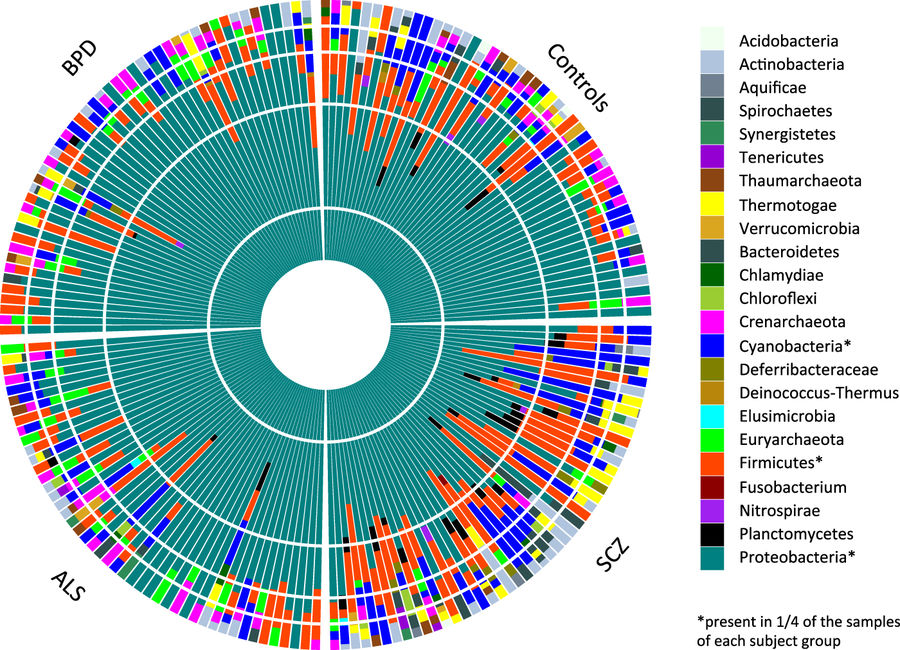
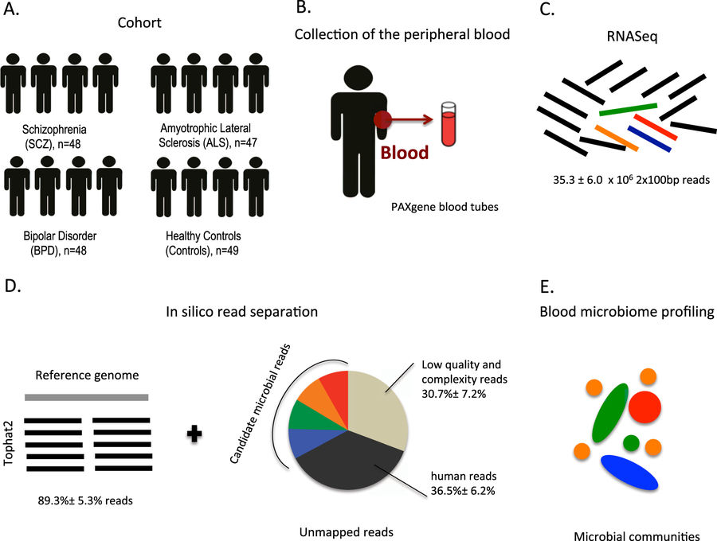

### Summary
Along with collaborators at UCLA, we were able to detect a small, but significant amount of microbes in blood This is surprising since it's typically assumed that the immune system typically removes any microbial presence from human blood. I used a reference-free microbial community algorithm, called EMDeBruijn, to help corroborate the patterns we saw which included an increase in microbial diversity in schizophrenia patients. EMDeBruijn is a metric based on the Wasserstein metric (aka the Earth Mover's Distance) and a de Bruijn graph induced by the k-mers in a metagenomic DNA sample.

### Abstract
The role of the human microbiome in health and disease is increasingly appreciated. We studied the composition of microbial communities present in blood across 192 individuals, including healthy controls and patients with three disorders affecting the brain: schizophrenia, amyotrophic lateral sclerosis, and bipolar disorder. By using high-quality unmapped RNA sequencing reads as candidate microbial reads, we performed profiling of microbial transcripts detected in whole blood. We were able to detect a wide range of bacterial and archaeal phyla in blood. Interestingly, we observed an increased microbial diversity in schizophrenia patients compared to the three other groups. We replicated this finding in an independent schizophrenia case–control cohort. This increased diversity is inversely correlated with estimated cell abundance of a subpopulation of CD8+ memory T cells in healthy controls, supporting a link between microbial products found in blood, immunity and schizophrenia.

