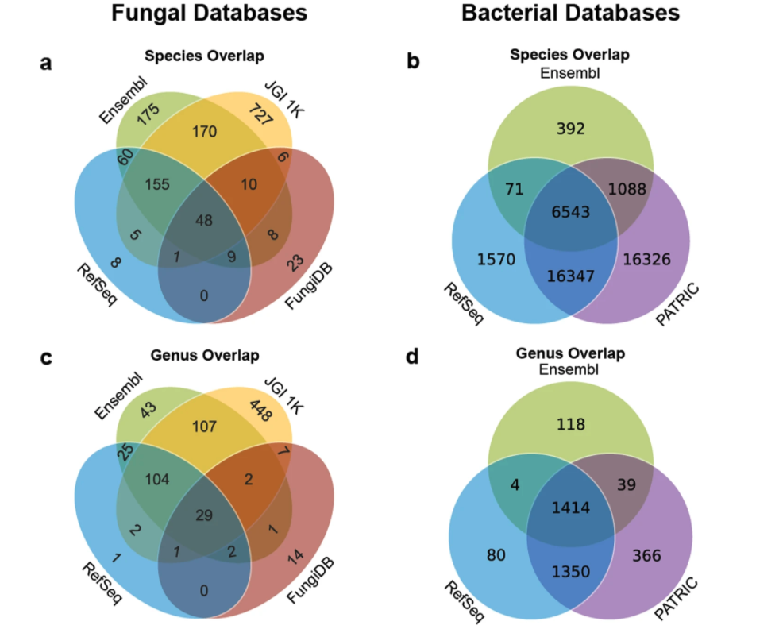

### Summary
We analyze and discuss guidelines for the development of a master reference database for
disparate reference databases.

### Abstract
Metagenomics studies leverage genomic reference databases to generate discoveries in basic science and translational research. However, current microbial studies use disparate reference databases that lack consistent standards of specimen inclusion, data preparation, taxon labelling and accessibility, hindering their quality and comprehensiveness, and calling for the establishment of recommendations for reference genome database assembly. Here, we analyze existing fungal and bacterial databases and discuss guidelines for the development of a master reference database that promises to improve the quality and quantity of omics research.

