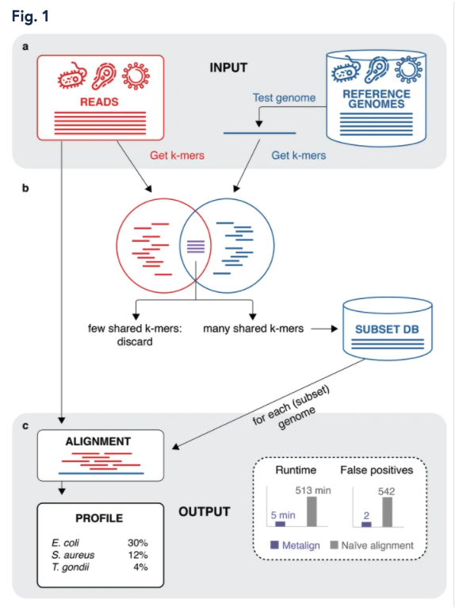

### Summary
Utilizing a pre-filter strategy, Metalign performs efficient and accurate alignment-based metagenomic profiling through the estimation of contaiment indices of pre-built reference databases.

### Abstract
Metagenomic profiling, predicting the presence and relative abundances of microbes in a sample, is a critical first step in microbiome analysis. Alignment-based approaches are often considered accurate yet computationally infeasible. Here, we present a novel method, Metalign, that performs efficient and accurate alignment-based metagenomic profiling. We use a novel containment min hash approach to pre-filter the reference database prior to alignment and then process both uniquely aligned and multi-aligned reads to produce accurate abundance estimates. In performance evaluations on both real and simulated datasets, Metalign is the only method evaluated that maintained high performance and competitive running time across all datasets.

