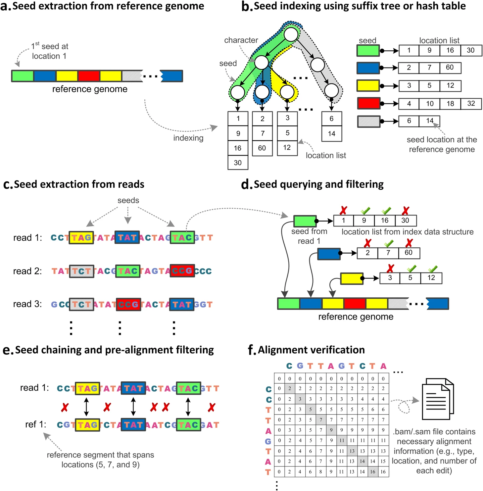

### Summary
We provide a systematic survey of 107 long and short read alignment tools and analyze how alignment algorithms have co-evolved with sequencing technology advancements, as well as how these algorithmic changes affect tool performance.

### Abstract

Aligning sequencing reads onto a reference is an essential step of the majority of genomic analysis pipelines. Computational algorithms for read alignment have evolved in accordance with technological advances, leading to today’s diverse array of alignment methods. We provide a systematic survey of algorithmic foundations and methodologies across 107 alignment methods, for both short and long reads. We provide a rigorous experimental evaluation of 11 read aligners to demonstrate the effect of these underlying algorithms on speed and efficiency of read alignment. We discuss how general alignment algorithms have been tailored to the specific needs of various domains in biology.

