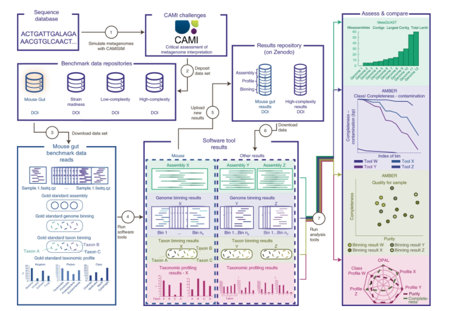

### Summary
Tutorial for using CAMI toolkits to access metagenomic software.

### Abstract

Computational methods are key in microbiome research, and obtaining a quantitative and unbiased performance estimate is important for method developers and applied researchers. For meaningful comparisons between methods, to identify best practices and common use cases, and to reduce overhead in benchmarking, it is necessary to have standardized datasets, procedures and metrics for evaluation. In this tutorial, we describe emerging standards in computational meta-omics benchmarking derived and agreed upon by a larger community of researchers. Specifically, we outline recent efforts by the Critical Assessment of Metagenome Interpretation (CAMI) initiative, which supplies method developers and applied researchers with exhaustive quantitative data about software performance in realistic scenarios and organizes community-driven benchmarking challenges. We explain the most relevant evaluation metrics for assessing metagenome assembly, binning and profiling results, and provide step-by-step instructions on how to generate them. The instructions use simulated mouse gut metagenome data released in preparation for the second round of CAMI challenges and showcase the use of a repository of tool results for CAMI datasets. This tutorial will serve as a reference for the community and facilitate informative and reproducible benchmarking in microbiome research.

