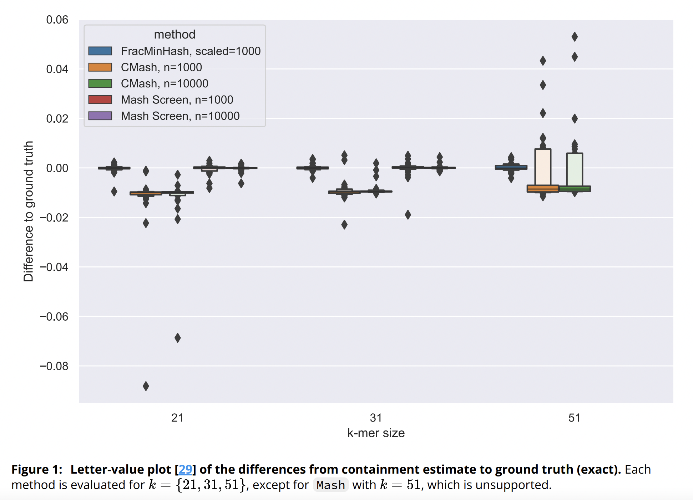

### Summary
Implementation of FracMinHash sketching technique into sourmash software package, and analysis of FracMinHash in shotgun metagenome compositional analysis after modeling the problem as minimum metagenome cover

### Abstract
The identication of reference genomes and taxonomic labels from metagenome data underlies many microbiome studies. Here we describe two algorithms for compositional analysis of metagenome sequencing data. We rst investigate the FracMinHash sketching technique, a derivative of modulo hash that supports Jaccard containment estimation between sets of dierent sizes. We implement FracMinHash in the sourmash software, evaluate its accuracy, and demonstrate large-scale containment searches of metagenomes using 700,000 microbial reference genomes. We next frame shotgun metagenome compositional analysis as the problem of nding a minimum collection of reference genomes that “cover” the known k-mers in a metagenome, a minimum set cover problem. We implement a greedy approximate solution using FracMinHash sketches, and evaluate its accuracy for taxonomic assignment using a CAMI community benchmark. Finally, we show that the minimum metagenome cover can be used to guide the selection of reference genomes for read mapping. sourmash is available as open source software under the BSD 3-Clause license at github.com/diblab/sourmash/.

