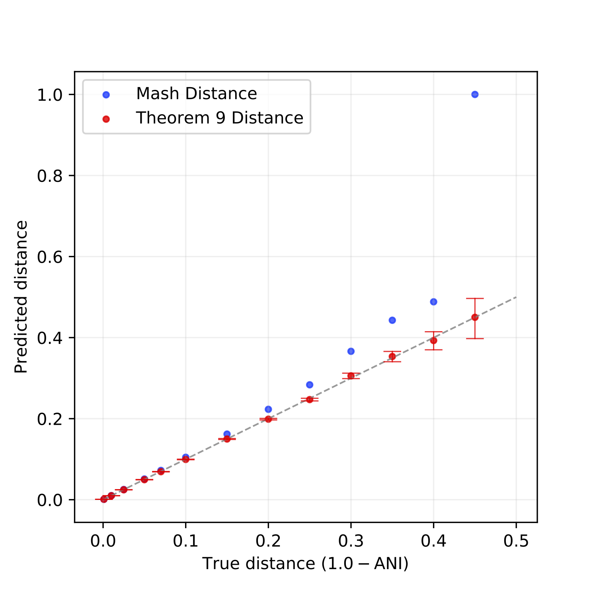

### Summary
In this paper, we theoretically analyzed FracMinHash, proved a bias in the estimator, and finally showed how to debias the estimator. We then showed how this FracMinHash estimator can be used to estimate the evolutionary distance of two genomes. Our results show that mutation rates determined by our analyses are more accurate across a wider range of evolutionary distances compared to classical MinHash techniques.

### Abstract
Sketching methods offer computational biologists scalable techniques to analyze data sets that continue to grow in size. MinHash is one such technique that has enjoyed recent broad application. However, traditional MinHash has previously been shown to perform poorly when applied to sets of very dissimilar sizes. FracMinHash was recently introduced as a modification of MinHash to compensate for this lack of performance when set sizes differ. While experimental evidence has been encouraging, FracMinHash has not yet been analyzed from a theoretical perspective. In this paper, we perform such an analysis and prove that while FracMinHash is not unbiased, this bias is easily corrected. Next, we detail how a simple mutation model interacts with FracMinHash and are able to derive confidence intervals for evolutionary mutation distances between pairs of sequences as well as hypothesis tests for FracMinHash. We find that FracMinHash estimates the containment of a genome in a large metagenome more accurately and more precisely when compared to traditional MinHash, and the confidence interval performs significantly better in estimating mutation distances. A python-based implementation of the theorems we derive is freely available at https://github.com/KoslickiLab/mutation-rate-ci-calculator. The results presented in this paper can be reproduced using the code at https://github.com/KoslickiLab/ScaledMinHash-reproducibles.

