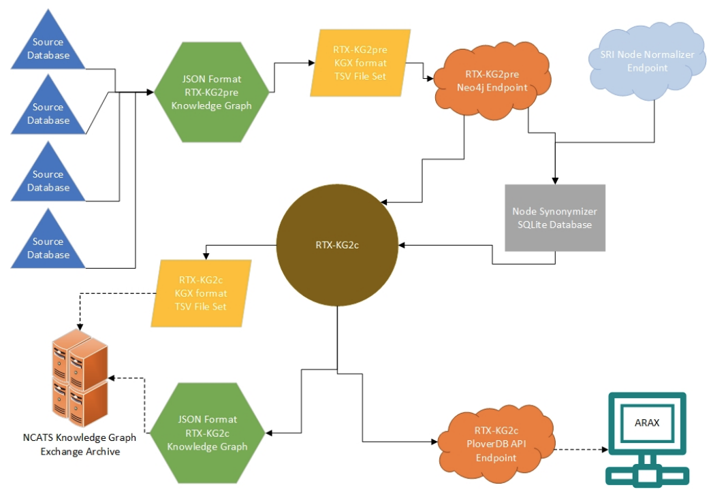

### Summary
We develop RTX-KG2, a biomedical knowledge graph that uses an Extract-Transform-Load (ETL) approach to integrate 70 knowledge sources (including UMLS, SemMedDB, ChEMBL, DrugBank, SMPDB, and 65 additional knowledge sources) into a single knowledge graph and conforms to the Biolink standard metamodel.

### Abstract
__Background__: Biomedical translational science is increasingly leveraging computational reasoning
on large repositories of structured knowledge (such as the Unified Medical Language System
(UMLS), the Semantic Medline Database (SemMedDB), ChEMBL, DrugBank, and the Small
Molecule Pathway Database (SMPDB)) and data in order to facilitate discovery of new
therapeutic targets and modalities. Since 2016, the NCATS Biomedical Data Translator project
has been working to federate autonomous reasoning agents and knowledge providers within a
distributed system for answering translational questions. Within that project and within the field
more broadly, there is an urgent need for an open-source framework that can efficiently and
reproducibly build an integrated, standards-compliant, and comprehensive biomedical knowledge
graph that can be either downloaded in standard serialized form or queried via a public
application programming interface (API) that accords with the FAIR data principles.

__Results__: To create a knowledge provider system within the Translator project, we have developed
RTX-KG2, an open-source software system for building—and hosting a web API for querying—a
biomedical knowledge graph that uses an Extract-Transform-Load (ETL) approach to integrate
70 knowledge sources (including the aforementioned sources) into a single knowledge graph. The
semantic layer and schema for RTX-KG2 follow the standard Biolink metamodel to maximize
interoperability within Translator. RTX-KG2 is currently being used by multiple Translator
reasoning agents, both in its downloadable form and via its SmartAPI-registered web interface.
JavaScript Object Notation (JSON) serializations of RTX-KG2 are available for download of
RTX-KG2 in both the pre-canonicalized form and in canonicalized form (in which synonym
concepts are merged). The current canonicalized version (KG2.7.3) of RTX-KG2 contains 6.4M
concept nodes and 39.3M relationship edges with a rich set of 77 relationship types.

__Conclusion__: RTX-KG2 is the first open-source knowledge graph of which we are aware that
integrates UMLS, SemMedDB, ChEMBL, DrugBank, SMPDB, and 65 additional knowledge
sources within a knowledge graph that conforms to the Biolink standard for its semantic layer and
schema at the intersections of these databases. RTX-KG2 is publicly available for querying via its
(API) at [arax.ncats.io/api/rtxkg2/v1.2/openapi.json](arax.ncats.io/api/rtxkg2/v1.2/openapi.json). The code to build RTX-KG2 is publicly
available at [github:RTXteam/RTX-KG2](github:RTXteam/RTX-KG2).

