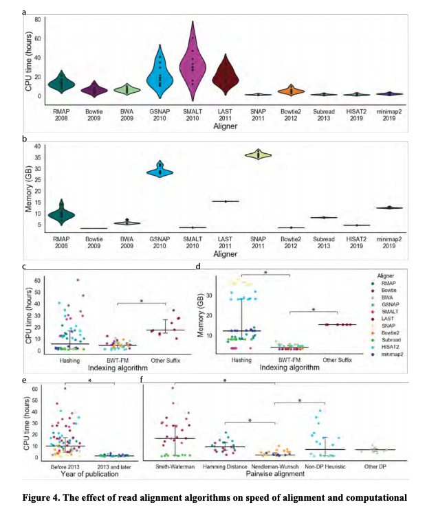

### Summary
We provide rigorous experimental evaluation of 11 read aligners to demonstrate the effect of these underlying algorithms on speed and efficiency of read aligners.

### Abstract
Massively parallel sequencing techniques have revolutionized biological and medical sciences by providing unprecedented insight into the genomes of humans, animals, and microbes. Modern sequencing platforms generate enormous amounts of genomic data in the form of nucleotide sequences or reads. Aligning reads onto reference genomes enables the identification of individual-specific genetic variants and is an essential step of the majority of genomic analysis pipelines. Aligned reads are essential for answering important biological questions, such as detecting mutations driving various human diseases and complex traits as well as identifying species present in metagenomic samples. The read alignment problem is extremely challenging due to the large size of analyzed datasets and numerous technological limitations of sequencing platforms, and researchers have developed novel bioinformatics algorithms to tackle these difficulties. Importantly, computational algorithms have evolved and diversified in accordance with technological advances, leading to todays diverse array of bioinformatics tools. Our review provides a survey of algorithmic foundations and methodologies across 107 alignment methods published between 1988 and 2020, for both short and long reads. We provide rigorous experimental evaluation of 11 read aligners to demonstrate the effect of these underlying algorithms on speed and efficiency of read aligners. We separately discuss how longer read lengths produce unique advantages and limitations to read alignment techniques. We also discuss how general alignment algorithms have been tailored to the specific needs of various domains in biology, including whole transcriptome, adaptive immune repertoire, and human microbiome studies.

