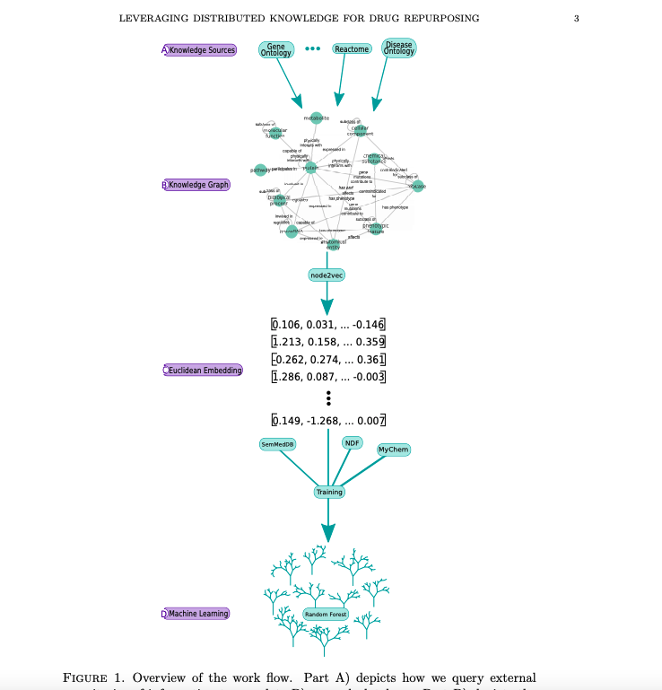

### Summary
We leverage a graph-based approach to integrate biological knowledge and then employ a graph node embedding scheme to make novel predictions about current drugs.

### Abstract
Computational drug repurposing, also called drug repositioning, is a low cost, promising tool for finding new uses for existing drugs. With the continued growth of repositories of biomedical data and knowledge, increasingly varied kinds of information are available to train machine learning approaches to drug repurposing. However, existing efforts to integrate a diversity of data sources have been limited to only a small selection of data types, typically gene expression data, drug structural information, and protein interaction networks. In this study, we leverage a graph-based approach to integrate biological knowledge from 20 publicly accessible repositories to represent information involving 11 distinct bioentity types. We then employ a graph node embedding scheme and use utilize a random forest model to make novel predictions about which drugs can be used to treat certain diseases. Utilizing this approach, we find a performance improvement over existing computational drug repurposing approaches and find promising drug repositioning targets, including drug and disease pairs currently in clinical trials.

