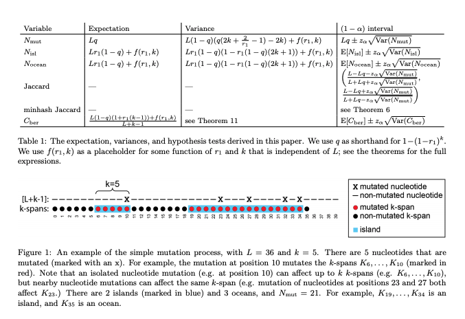

### Summary
We derive hypothesis tests and confidence intervals for sequence similarities based on simple mutation process.

### Abstract
K-mer-based methods are widely used in bioinformatics, but there are many gaps in our understanding of their statistical properties. Here, we consider the simple model where a sequence S (e.g. a genome or a read) undergoes a simple mutation process whereby each nucleotide is mutated independently with some probability r, under the assumption that there are no spurious k-mer matches. How does this process affect the k-mers of S? We derive the expectation and variance of the number of mutated k-mers and of the number of islands (a maximal interval of mutated k-mers) and oceans (a maximal interval of non-mutated k-mers). We then derive hypothesis tests and confidence intervals for r given an observed number of mutated k-mers, or, alternatively, given the Jaccard similarity (with or without minhash). We demonstrate the usefulness of our results using a few select applications: obtaining a confidence interval to supplement the Mash distance point estimate, filtering out reads during alignment by Minimap2, and rating long read alignments to a de Bruijn graph by Jabba.

