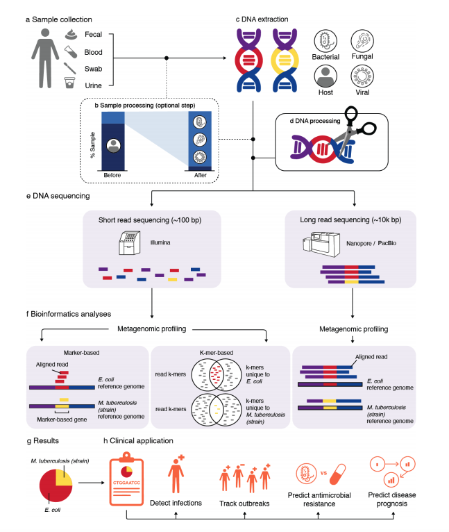

### Summary
We present an overview of metagenomics methods with a discussion of computational challenges and limitations.

### Abstract
The human-associated microbiome is closely tied to human health and is of substantial clinical interest. Metagenomics-based tools are emerging for clinical diagnostics, tracking the spread of diseases, and surveillance of potential pathogens. In some cases, these tools are overcoming limitations of traditional clinical approaches. Metagenomics has limitations barring the tools from clinical validation. Once these hurdles are overcome, clinical metagenomics will inform doctors of the best, targeted treatment for their patients and provide early detection of disease. Here we present an overview of metagenomics methods with a discussion of computational challenges and limitations.

